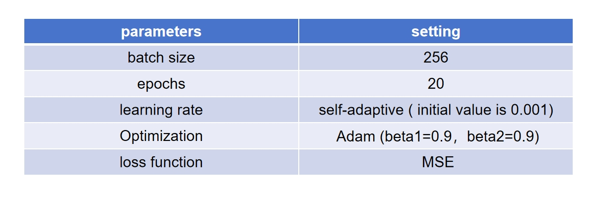

# A CNN training framework for captcha recognition.

## introduction
This framework is designed for deep learning beginners, can be used to experience the training process of neural networks, experience tuning optimization, is very easy to deploy, and can run on your personal computer in a short time.

## overview

## dataset

dataset generator can generate arbitrary datasets by Captcha package.

## test

The pure numeric CAPTCHA, pure uppercase letter CAPTCHA and alphanuloid mixed CAPTCHA are tested, and resnet50 in the model pool is used for testing, and the accuracy is 99.7%,99.3%,96.5%.

## some tips
- users can customize their own network model.
- cpu/gpu training/testing is supported.
- datasets can be customized and generated directly.
- users can learn efficient methods for model train and test.
- using pytorch framework.
- easy deploy on your python env.
- convenient for users to adjust the parameters of the experiment.

## how to run
- git clone or download zip.
- install the required packages.
- modify parameters for your model or add model.
- use dataset generator to generate the dataset.
- train and test the model.

## todo list
- implement a client using PyQt, which makes it easy for users to change parameters and so on.
- add a logging module, which is convenient for users to review and summarize after model training.
- add more models or tools, increase the richness of the "model pool", and give users more options.
- add a visualization module allows users to visualize the parameters using visualization tools, etc.

## attention
- console interaction, you can choose diyCNN,ResNet etc.
- the dataset has high complexity and contains noise, curve and other interference information.
- the project is not yet complete and there are multiple directions for optimization.
